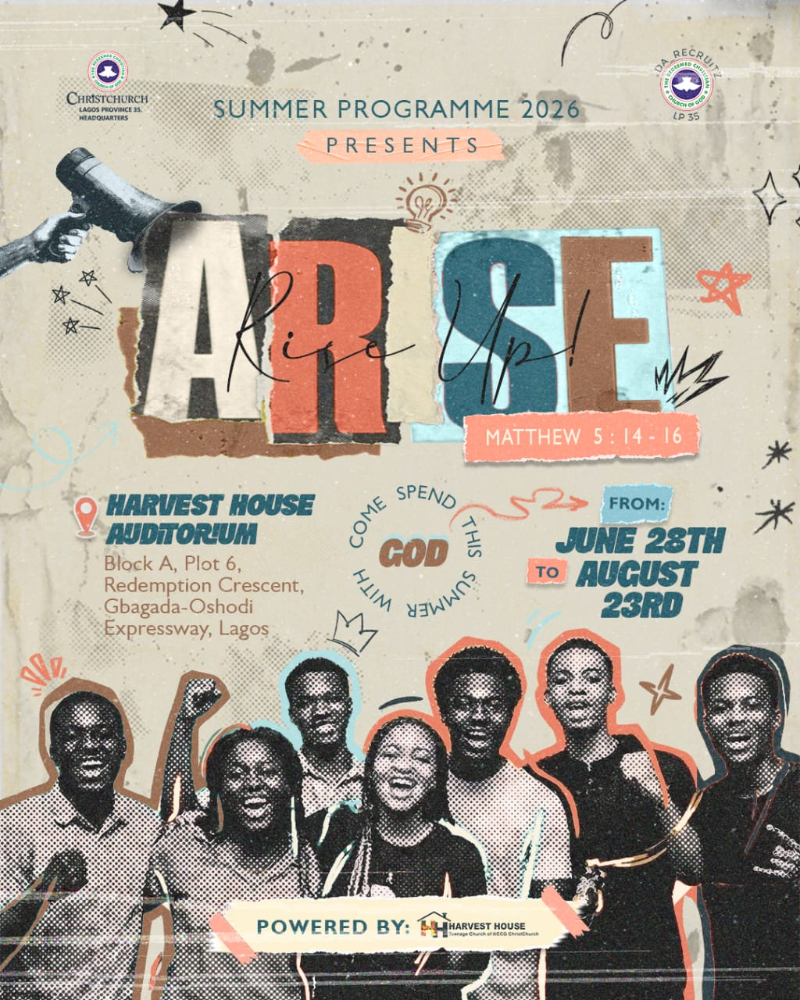

# ARISE Summer Camp 2026



Welcome to the official repository for the **ARISE Summer Camp 2026** landing page. This project is a highly interactive, premium web experience built to facilitate registrations for campers, teachers, and volunteers.

## 🚀 Overview

This website is built with a focus on performance, aesthetic excellence, and user experience. 

It features:
- **Zero Dependencies:** Built entirely with pure HTML, CSS, and Vanilla JavaScript. No heavy frameworks or build tools.
- **Premium Interactions:** Custom 3D tilt-card effects, magnetic glassmorphic buttons, and a dynamic "curtain reveal" parallax footer.
- **Tally.so Integration:** Seamless modal popups for role-based event registration (Camper, Teacher, Volunteer).
- **Responsive Design:** Fluid typography and shifting layouts that look gorgeous on both massive desktop displays and mobile screens.

## 🛠️ How to Run Locally

Since this is a static website, you do not need to install `npm` packages or run a complex build step.

1. **Clone the repository:**
   ```bash
   git clone https://github.com/tannyakin/HNH.git
   cd HNH
   ```
2. **Start a local server:**
   You can use Python's built-in HTTP server or any extension like VSCode Live Server.
   ```bash
   python -m http.server 8000
   ```
3. **Open your browser:**
   Visit `http://localhost:8000/` (or whichever port your server assigns).

## 🌍 Deployment

This project is configured for instant deployment on **Vercel**. 
Whenever changes are pushed to the `main` branch, Vercel will automatically build and deploy the `index.html` file globally within seconds.

## 🤖 AI & Developer Instructions

If you are an AI assistant or a developer contributing to this codebase, please strictly review the **[agent.md](agent.md)** file before making any modifications. It contains the mandatory design system tokens, typography rules, and architectural guidelines required to maintain the integrity of this project.

---
*Created for Harvest House · Teenage Church of RCCG ChristChurch, Lagos Province 35.*
